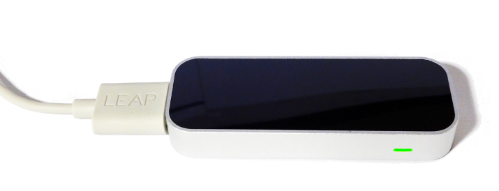

# io-leap

Nim bindings for the Leap Motion SDK.



## About

io-leap contains bindings to the Leap Motion SDK for the
[Nim](http://nim-lang.org) programming language. Leap Motion provides 3D
tracking devices for natural user input.


## Supported Platforms

io-leap was last built and tested with **Leap SDK 2.2.2**. The bindings in this
package currently support the following platforms:

- ~~Linux~~
- ~~Mac OSX~~
- ~~Windows~~


## Prerequisites

To compile the bindings in this package you must have the **Leap SDK** installed
on your computer. Users of your program need to install the **Leap Setup**
software that implements the actual device driver, which can be downloaded from
the Leap Motion website.

### Linux

If your Linux distribution includes a package manager or community repository,
it may already have pre-compiled binaries for both the drivers and the SDK. For
example, on ArchLinux they are available in the AUR repository:

```
yaourt leap-motion-driver
yaourt leap-motion-sdk
```

Make sure to verify the available version numbers as they may be outdated. It is
then preferable to download and install the software directly from the Leap
Motion web site.

### MacOSX

TODO

### Windows

TODO


## Dependencies

io-leap does not have any dependencies to other Nim packages at this time.


## Usage

Import the *leap* module from this package to make the bindings available in
your project:

```nimrod
import leap
```


## Support

Please [file an issue](https://github.com/nimious/io-leap/issues), submit a
[pull request](https://github.com/nimious/io-leap/pulls?q=is%3Aopen+is%3Apr)
or email us at info@nimio.us if this package is out of date or contains bugs.
For issues related to input devices or the device driver software visit the
Leap Motion web sites below.


## References

* [Leap Motion Homepage](http://www.leapmotion.com/)
* [Leap Motion Developer Portal](http://developer.leapmotion.com/)
* [Nim Programming Language](http://nim-lang.org/)
